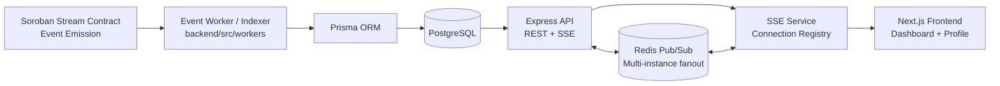
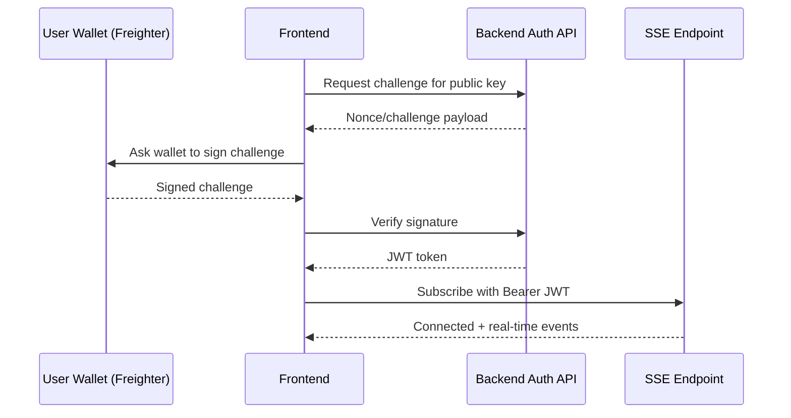

# FlowFi Architecture

This document explains how FlowFi moves data from on-chain contract events into API responses and real-time frontend updates.

## High-Level Overview



## Core Components

1. Soroban contract: source of truth for stream state and events.
1. Event worker/indexer: reads events from Stellar/Soroban, normalizes payloads, and persists stream state + stream events.
1. PostgreSQL + Prisma: query layer for fast read APIs.
1. Express API: serves versioned REST endpoints and long-lived SSE subscriptions.
1. Frontend: consumes REST for initial state and SSE for real-time deltas.

## Event Type Data Flows

### 1) CREATED

1. Contract emits `CREATED`.
1. Worker inserts `Stream` row with sender, recipient, token, amount/rate/timestamps.
1. Worker inserts `StreamEvent` row.
1. SSE broadcasts `stream.created` to stream and user channels.
1. Frontend refreshes outgoing/incoming lists and summary cards.

### 2) TOPPED_UP

1. Contract emits `TOPPED_UP` with top-up amount.
1. Worker updates `Stream.depositedAmount` and `lastUpdateTime`.
1. Worker inserts `StreamEvent`.
1. SSE broadcasts `stream.topped_up`.
1. Frontend updates TVL/deposit values.

### 3) WITHDRAWN

1. Contract emits `WITHDRAWN` with claimed amount.
1. Worker updates `Stream.withdrawnAmount` and `lastUpdateTime`.
1. Worker inserts `StreamEvent`.
1. SSE broadcasts `stream.withdrawn`.
1. Frontend updates balances and claimable indicators.

### 4) CANCELLED

1. Contract emits `CANCELLED`.
1. Worker marks `Stream.isActive = false` and updates `lastUpdateTime`.
1. Worker inserts `StreamEvent`.
1. SSE broadcasts `stream.cancelled`.
1. Frontend moves stream to historical state.

### 5) COMPLETED

1. Contract emits `COMPLETED` (fully drained lifecycle).
1. Worker marks `Stream.isActive = false`.
1. Worker inserts `StreamEvent`.
1. SSE broadcasts `stream.completed`.
1. Frontend marks stream complete.

### 6) PAUSED / RESUMED

FlowFi timing math supports pause windows by excluding paused wall-clock duration from effective streaming time.

Paused behavior:

1. On `PAUSED`, worker stores pause start metadata and stream remains non-progressing.
1. On `RESUMED`, worker computes paused interval duration and accumulates `totalPausedSeconds`.
1. Claimable calculations use effective elapsed time:

$$
\text{effectiveElapsed} = \max(0,\, now - lastUpdateTime - totalPausedSecondsSinceLastUpdate)
$$

$$
\text{streamed} = \text{effectiveElapsed} \times \text{ratePerSecond}
$$

$$
\text{claimable} = \min(\text{streamed},\, depositedAmount - withdrawnAmount)
$$

This prevents paused periods from increasing claimable balance.

## Pause/Resume Timing Model

Rules used by backend/domain logic:

1. Time is tracked in Unix seconds.
1. Claimable only advances while stream is active and not paused.
1. Multiple pause/resume intervals are cumulative.
1. Resume re-baselines time accounting so no double counting occurs.
1. Cancellation/completion finalizes stream and halts further accrual.

## Authentication Flow

See [Authentication Documentation](../backend/docs/AUTHENTICATION.md) for full details.



## SSE in Single vs Multi-Instance Mode

Single instance:

1. API writes SSE event directly to in-memory client registry.

Multi-instance (recommended for horizontal scale):

1. Instance A receives event and publishes to Redis channels (`sse:stream:*`, `sse:user:*`).
1. All API instances subscribe to matching channels.
1. Each instance rebroadcasts to its own connected clients.

Benefits:

1. Real-time fanout works across replicas.
1. Sticky sessions are not required for event delivery.
1. API replicas can scale independently while preserving SSE correctness.

## Operational Notes

1. `/v1/events/stats` exposes active SSE connections and connection-capacity metrics.
1. Admin metrics include SSE peak-per-IP visibility for abuse monitoring.
1. User summary endpoint (`/v1/users/{address}/summary`) is cached for 30s to protect DB hot paths.

---

## Event Indexing & Real-Time Updates

### Data-Flow Overview

```
Soroban RPC
    │  poll for new contract events
    ▼
SorobanEventWorker  (backend/src/workers/soroban-event-worker.ts)
    │  normalize payload, upsert Stream row, insert StreamEvent row
    ▼
PostgreSQL  (via Prisma)
    │  StreamEvent table / Stream table updated
    ▼
SSE broadcast  (backend/src/services/sseService.ts)
    │  pushes typed event to sse:stream:<id> and sse:user:<address> channels
    ▼
Frontend useStreamEvents hook  (frontend/src/hooks/useStreamEvents.ts)
    │  receives event over long-lived SSE connection
    ▼
Dashboard / NotificationDropdown  re-render with live data
```

### Deduplication

`StreamEvent` rows carry a compound unique constraint:

```
@@unique([transactionHash, eventType])
```

This means replaying the same on-chain transaction (e.g. during a re-index or worker restart) will produce an `upsert` conflict rather than a duplicate row. The worker uses Prisma's `createOrUpdate` (upsert) path on `Stream` and a `createMany … skipDuplicates` path on `StreamEvent`.

### Indexer Cursor — `IndexerState`

The worker persists its progress in the `IndexerState` table (a single-row ledger-sequence cursor). On each poll cycle:

1. Read the stored `lastIndexedLedger` value.
2. Query the Soroban RPC for events emitted in `(lastIndexedLedger, latestLedger]`.
3. Process and persist events.
4. Update `IndexerState.lastIndexedLedger` to `latestLedger`.

On a cold start (no `IndexerState` row) the worker begins from a configured genesis ledger so historical streams are backfilled.

### Stale-Read Fallback

When the DB row for a stream was last updated more than a configurable threshold ago (`isStale` check in `backend/src/services/sorobanService.ts`), the API falls back to a live Soroban RPC call instead of serving the cached DB value. This keeps claimable-balance figures accurate even if the indexer lags.

---

## Action Signing Model

FlowFi actions split into two categories based on who holds the signing key:

| Action | Signer | How |
|---|---|---|
| **Top-up** | Server (custodial) | Backend submits the transaction using `KEEPER_SECRET_KEY`. The frontend sends only the stream ID and amount. |
| **Withdraw** | Wallet (non-custodial) | Frontend builds and signs the transaction via the connected wallet (Freighter). The backend currently only simulates server-side; the real transaction is signed and submitted by the frontend. |
| **Pause / Resume** | Wallet (non-custodial) | Same as withdraw — frontend-signed. The backend simulate endpoints exist for fee estimation but do not submit. |
| **Create stream** | Wallet (non-custodial) | Frontend signs via wallet and submits directly to the RPC. |

> **Important for contributors:** Do not wire pause/resume/withdraw to a server-side submit path. Only `top-up` is intentionally custodial. All other mutating actions must be wallet-signed by the user.

---

## Required Environment Variables

To run the full stack end-to-end, set the following secrets. See [`backend/.env.example`](../backend/.env.example) for the canonical list.

### Backend

| Variable | Purpose |
|---|---|
| `DATABASE_URL` | PostgreSQL connection string (Prisma) |
| `SOROBAN_RPC_URL` | Soroban RPC endpoint (e.g. Testnet: `https://soroban-testnet.stellar.org`) |
| `STREAM_CONTRACT_ID` | Deployed FlowFi stream contract ID |
| `KEEPER_SECRET_KEY` | Server wallet secret key used to sign custodial top-up transactions |
| `JWT_SECRET` | Secret used to sign and verify auth JWTs |
| `REDIS_URL` | Redis connection string (only needed for multi-instance SSE fanout) |
| `STELLAR_NETWORK` | `testnet` or `mainnet` |

### Frontend

| Variable | Purpose |
|---|---|
| `NEXT_PUBLIC_API_URL` | Base URL of the backend API (e.g. `http://localhost:3001/v1`) |
| `NEXT_PUBLIC_STREAMING_CONTRACT` | Contract address displayed in the Settings page |
| `NEXT_PUBLIC_STELLAR_NETWORK` | `TESTNET` or `MAINNET` — must match the backend value |
| `NEXT_PUBLIC_APP_VERSION` | Displayed in Settings; optional, defaults to `1.0.0` |
